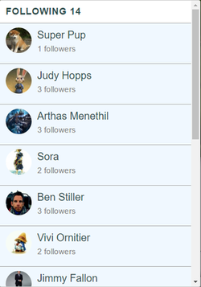

# TravelingPx

[TravelingPx][heroku]

[heroku]: http://www.travelingpx.stream/

TravelingPx is a photo sharing web application inspired by [500px][500px-link]. It utilizes Ruby on Rails, a PostgreSQL database, and React.js with a Flux architecture. TravelingPx is truly a single-page application by using AJAX requests to update React components and deliver all content on one static page.

## Splash Page
The theme of the TravelingPx is traveling photos, but not just traveling around the world. It also includes imagery from games and other avenues which you can have an adventure.

[500px-link]: https://500px.com/


TravelingPx starts at the splash page allowing guests to check out already uploaded photos and user profiles.

## Features

### Photo viewing, uploading and editing

The main feature of TravelingPx is the ability to upload photos to showcase your travels. Users can edit or delete their photos when they are logged in.


The photos are uploaded using imagemagick and paperclip gem and hosted on Amazon Web Services. React-dropzone is incorporated to provide drag and drop for easy uploading. When a photo is dropped or uploaded, it transitions to an upload form.

```JavaScript
photoDropped () {
  if (this.state.imageFile) {
    return (
      <PhotoForm imageURL={this.state.imageURL}
        imageFile={this.state.imageFile}
        close={this.onModalClose} />
    );
  } else {
    return (
      <Dropzone ref="dropzone"
          className="dropzone"
          activeClassName="dragging"
          multiple={false} disableClick={true}
          accept='image/*' onDrop={this.onDrop}>

        <button onClick={this._onOpenClick}>
          Browse Photos
        </button>

        <div>Or drag & drop photos anywhere in this box</div>
      </Dropzone>
    );
  }
},
```

### Follows and Profile



TravelingPx also provides the ability to see the users that they are following and who they themselves are followed by. This allows smooth navigation from profile to profile. All users profile data including followers and followings data is returned through jbuilder by utilizing the users table associations.

```Ruby
json.partial! 'api/users/user', user: @user

json.photos @user.photos do |photo|
  json.partial! "api/photos/photo", photo: photo
end

json.followees @user.followees do |followee|
  json.followerId @user.id
  json.followeeId followee.id
  json.partial! "api/follows/follow", follow: followee
end
```


When logged in, users are able to edit their profile from their own profile page. They can change their name, location, about description, and upload or update their avatar or cover photos, both which also utilizes paperclip and AWS.

### Home feed


Lastly when logged in, users are provided with a home feed instead of the splash page. Users will get updates from users who they are following when they upload new photos, sorted by the newest first. Since new users will not have any followings, ten of the latest photo uploads will be shown on their home feed until they follow another user.

```Ruby
def home
  following = []

  if current_user
    following = current_user.followees.map(&:id)
  end

  if following.empty?
    @photos = Photo.order("created_at DESC").limit(10)
  else
    @photos = Photo.where(poster_id: following).order("created_at DESC")
  end

  render 'api/photos/home'
end
```

## Future Directions for the Project
  - Follow suggestions and discover
  - Comments: Users can comment on photos
  - Tags: A tagging system allowing users to see all photos with the same tag.
  - Likes
  - OAuth: Allow users to sign up with gmail and facebook.
